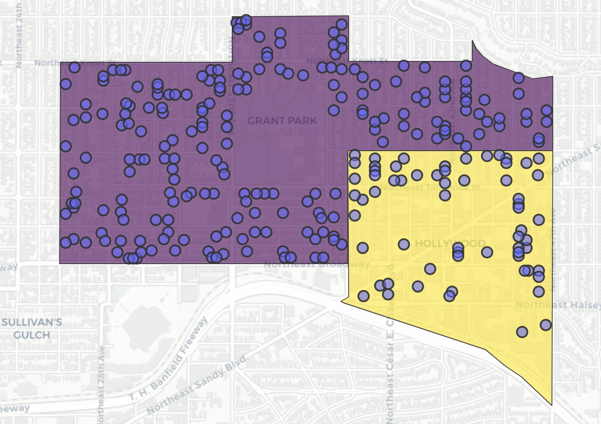
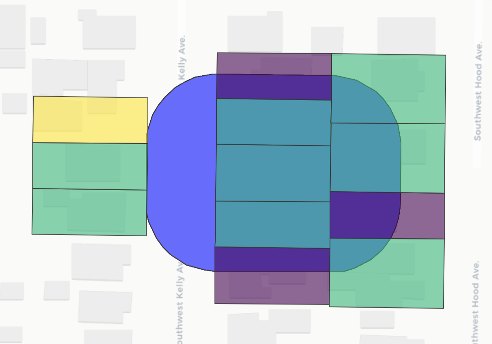

# Thesis

# General Overview
### Title: Constructing the BPS Property Attributes Dataset
#### Non-market Valuation in Portland, OR
This project is part of a year-long thesis in consultation with Noelwah Netusil at Reed College and the Bureau of Planning and Sustainability. 

### Abstract: 
 Our goal is to amass a single data frame from several separate sources. With this data frame, we will calculate the marginal influence of environmental constraints (i.e. location within a 100-year floodplain, locating within a historic district, etc.) on the sale price of properties that have transacted within Multnomah county in the last five years. This document lays out the methodology used to develop our data set starting from the source of our raw files to the data frame used to estimate a hedonic price function. 

### Creators: 
Salma Huque - Reed College '20, 

Ryan Kobler - Reed College '20

Nick Kobel - Data Analyst at Bureau of Planning and Sustainability, 

### Identifers: 
PROPERTYID

STATE_ID

### Date:
1. Received 10/10/2019 via USB -> [DATA/data1.gdb](#data1)
2. Received 10/29/2019 via email -> [DATA/data2.gdb](#data2)
3. Received 11/21/2019 via email -> [DATA/data-20191112.gdb](#data-20191112)
4. Received 11/22/2019 via email -> [DATA/tree_canopy.gdb](#tree_canopy) and [DATA/Zoning_History](#Zoning_History)
5. Received 11/25/2019 -> [DATA/ugb/ugb.shp](#ugb)
6. Received 2/04/2020 -> [DATA/zoning_crosswalk.xlsx](#zoning_crosswalk)
7. **Created 2/10/2020 in GIS -> [DATA/canopy_20200210.gdb](#canopy_20200210)
8. *Retrieved 2/11/2020 via OpenData.com -> [DATA/Complete_Neighborhoods_Scoring_Surface](#cn)
9. **Created 2/13/2020 in GIS -> [DATA/constraint_layers.gdb](#constraint_layers)
10. **Created 3/7/2020 in GIS using FEMA map (OpenData, link broken?) and 'building_footprints_20191010' layer (data1.gdb) -> [DATA/ft_fld.gdb](#ft_fld)
11. *Retrieved 4/2/2020 via OpenData.com -> [DATA/Portland_Administrative_Sextants/Portland_Administrative_Sextants.shp](#pdx_admin_sextants)

### Source:
- Queried from relational database at BPS and sent to us via email and USB
- *Retrieved separately from OpenData.com (not received in consultation with BPS).
- **Created by Ryan Kobler and Salma Huque using GIS Intersect tool, methods given below

### GIS Methods:
To create DATA/canopy_20200210.gdb, "canopy_taxlot_intersect" layer...
1. Load 'taxlots_20191010' layer from data1.gdb into new ArcMap file
2. Load 'canopy_class_2014_metro' layer from tree_canopy.gdb
3. Use intersect tool to intersect the above layers
4. Export intersected layer from ArcGIS to Shapefile

To create DATA/DATA/ft_fld.gdb, "ft_floodplain" layer...
1. Load 'building_footprints_20191010' layer from data1.gdb into new ArcMap file
2. Load 'FEMA' 100 year floodplain layer from OpenData.com, source: 
3. Use intersect tool to intersect the above layers
4. Export intersected layer from ArcGIS to Shapefile
  
***
# Raw Data Directory
Each of these databases are saved in a directory called "DATA" on each of our machines. The bullet points represent layers included in the larger geodatabase. The data frames with links have extra transformations performed, detailed in Processing. 

#### 1. data1.gdb <a name="data1"></a>  
- [footprints](#footprints) = "footprints_10102019" 
  - Description:
  - Dimensions: 
  - Geometry: MULTIPOLYGON
- taxlots = "taxlots_10102019"
  - Description: This comprises our unit of observation, if an observation is not included in this data frame, then it is not included in the analysis. All other data frames and attributes are left-joined here.
  - Dimensions: 197,717 x 49
  - Geometry: MULTIPOLYGON

#### 2. data2.gdb <a name="data2"></a>
- [impsegcop](#impsegcop) = "CoP_Improvement_Segments"
  - Descripton: data.frame object, interested in the `SegmentType`, `SegmentNbr`, `SegmentSqft` variables, which correspond to different types of improvements upon a taxlot. For example suppose a taxlot has a 100 sqft deck and a 30 sqft pool. Then we want to retain `DECK` and `POOL` as variables within the final data set where the cells are populated with the number of square feet of each improvement
  - Dimensions: 1,173,249 x 7
- [impseg](#impseg) = "Improvement_Segments"
  - Description: data.frame object, interested in the `Plumbing_Code` and `Fire_Place_Code` variables that take values FB1, HB2, etc.
  - Dimensions: 1,567,227 x 57
- [gisimpcop](#gisimpcop) = "CoP_GISImprovement"
  - Description: data.frame object, contains information on ADUs, identified by `PropID` (ex. R148129) and `PropertyID` (ex. 104648)
  - Dimensions:  282,451 x 12
- [school](#centroid_joins) = "school_attendance_areas"
  - Description: sf object, school catchment areas, divided into elementary, middle and high school
  - Dimensions: 113 x 8
  - Geometry: MULTIPOLYGON

#### 3. data-20191112.gdb <a name="data-20191112"></a>  
- [bli_constraints](#constraints) = "bli_constraints_all"
  - Dimensions: 204,375 x 30
  - Geometry: MULTIPOLYGON
  - Description: updated constraints layer, sf object. Contains all 27 of our constraints, missing taxlot identifiers.
  
- [nbhd](#centroid_joins) = "neighborhoods_no_overlap"
  - Dimensions: 99 x 13
  - Geometry: MULTIPOLYGON
  - Description: sf layer of 99 non-overlapping Portland neighborhoods whose levels include: 

| -- | -- | -- |
|--------|:-------|:------|
|  LINNTON | FOREST PARK | CATHEDRAL PARK|  
|  FOREST PARK | UNIVERSITY PARK | PIEDMONT|  
|  CATHEDRAL PARK | PIEDMONT | ARBOR LODGE|  
|  UNIVERSITY PARK | CULLY ASSOCIATION OF NEIGHBORS | PARKROSE|  
|  MC UNCLAIMED #14 | OVERLOOK | HUMBOLDT|  
|  PIEDMONT | PARKROSE | WILKES COMMUNITY GROUP|  
|  WOODLAWN | ARGAY TERRACE | ALAMEDA|  
|  CULLY ASSOCIATION OF NEIGHBORS | KING | ROSEWAY|  
|  ARBOR LODGE | WILKES COMMUNITY GROUP | IRVINGTON COMMUNITY ASSOCIATION|  
|  OVERLOOK | SABIN COMMUNITY ASSOCIATION | NORTHWEST DISTRICT ASSOCIATION|  
|  CONCORDIA | BOISE | PEARL DISTRICT|  
|  PARKROSE | ROSEWAY | SULLIVAN'S GULCH|  
|  SUMNER ASSOCIATION OF NEIGHBORS | ELIOT | KERNS|  
|  ARGAY TERRACE | ROSE CITY PARK | HAZELWOOD|  
|  HUMBOLDT | NORTHWEST DISTRICT ASSOCIATION | GOOSE HOLLOW FOOTHILLS LEAGUE|  
|  KING | GRANT PARK | PORTLAND DOWNTOWN|  
|  VERNON | HOLLYWOOD | SOUTHWEST HILLS RESIDENTIAL LEAGUE|  
|  WILKES COMMUNITY GROUP | SULLIVAN'S GULCH | CENTENNIAL COMMUNITY ASSOCIATION|  
|  BEAUMONT-WILSHIRE | LAURELHURST | SOUTH PORTLAND|  
|  SABIN COMMUNITY ASSOCIATION | HILLSIDE | POWELLHURST-GILBERT|  
|  ALAMEDA | HAZELWOOD | CRESTON-KENILWORTH|  
|  BOISE | ARLINGTON HEIGHTS | LENTS|  
|  NORTHWEST HEIGHTS | GLENFAIR | MT. SCOTT-ARLETA|  
|  ROSEWAY | PORTLAND DOWNTOWN | WOODSTOCK|  
|  MADISON SOUTH | MT. TABOR | MULTNOMAH|  
|  ELIOT | SUNNYSIDE | ARDENWALD-JOHNSON CREEK|  
|  IRVINGTON COMMUNITY ASSOCIATION | CENTENNIAL COMMUNITY ASSOCIATION | COLLINS VIEW|  
|  ROSE CITY PARK | RICHMOND | FAR SOUTHWEST|  
|  PARKROSE HEIGHTS ASSOCIATION OF NEIGHBORS | HOMESTEAD | LLOYD DISTRICT COMMUNITY ASSOCIATION|  
|  NORTHWEST DISTRICT ASSOCIATION | POWELLHURST-GILBERT | CRESTWOOD|  
|  RUSSELL | BRIDLEMILE | ST. JOHNS|  
|  GRANT PARK | HILLSDALE | BRIDGETON|  
|  PEARL DISTRICT | LENTS | PORTSMOUTH  |  

#### 4. tree_canopy.gdb <a name="tree_canopy"></a>  
- [bli_constraints_v2](#constraints) = "bli_constraints_v2_pts_run4"
  - Dimensions: 204,375 x 42 sf object
  - Geometry: POINT (centroids of the multipolygons)
  - Description: includes STATE_ID

#### 5. [ugb.shp](#ugb2) <a name="ugb"></a>
- Description: "The boundary controls urban expansion onto farm and forest lands. Metro is responsible for managing the Portland metropolitan region's urban growth boundary and is required by state law to have a 20-year supply of land for future residential development inside the boundary."
  - Source - http://rlisdiscovery.oregonmetro.gov/?action=viewDetail&layerID=178
- Dimensions: 1 x 3
- Geometry: MULTILINESTRING

#### 6. zoning_crosswalk.xlsx

#### 7. canopy_20200210.gdb <a name="canopy_20200210"></a>
- [canopy](#canopy) = "canopy_taxlot_intersect"
  - Description: intersected taxlot and canopy boundaries, all canopy cover in PDX that        intersects a taxlot
  - Dimensions: 824,307 x 52
  - Geometry: MULTIPOLYGON
  
#### 8. Complete Neighborhoods Scoring Surface <a name="cn"></a>
- [walk](#centroid_joins) = "Complete_Neighborhoods_Scoring_Surface"
  - Description: Measures the level of "completeness" of areas within the City of Portland. Completeness is defined by a neighborhood's proximity to various amenities, such as grocery stores, parks and recreation facilities, commercial services, elementary schools, pedestrian and bicycle infrastructure, and transit, normalized score (0-100).
    - Source - http://gis-pdx.opendata.arcgis.com/datasets/complete-neighborhoods-overlay
  - Dimensions: 325,594 x 5
  - Geometry: POLYGON
  
#### 9. constraint_layers.gdb <a name="constraint_layers"></a>
- intersectionz = "Intersectionz"
  - Description: 
  - Dimensions:
  - Geometry: 

#### 10. ft_fld.gdb <a name="ft_fld"></a>
- ftfld_ids = "ft_floodplain"
  - Description: sf object
  - Dimensions: 3,377 x 75
  - Geometry: MULTIPOLYGON

#### 11. Portland Administrative Sextants <a name="pdx_admin_sextants"></a>
- [quads](#centroid_joins) = "Portland_Administrative_Sextants.shp"
  - Description: Sf object, layer of polygons dividing Portland into 6 administrative sextants. Levels include N, NE, NW, S, SE, SW
    - Source - http://gis-pdx.opendata.arcgis.com/datasets/portland-administrative-sextants
  - Dimensions: 6 x 8
  - Geometry: POLYGON
  
***

# Content Description

### Variable list
See [dictionary.md](https://github.com/huques/Thesis/blob/master/dictionary.md "Data Dictionary") for all variable and value dictionaries associated with this project.

***

# Processing

9. Distance to Urban Growth Boundary (NEEDS PICTURE)
13. Accessory Dwelling Unit Dummy
14. Percent of Lot Covered by Canopy (needs picture)
16. 100-Year Floodplain Building Footprint Method
18. Partial Constraints
19. Zoning Changes


### Variable Transformations

#### 3. Take Sample of Taxlots
1) Initially the taxlots data frame had all taxlots within the city of Portland
2) Took observations that had transacted within the interval [2015/01/01 - 2019/01/01], format = YYYY/MM/DD.

```{r}
taxlots %>%
filter(saledate >= 2015-01-01 & saledate <= 2019-01-01)
```

#### 4, 5, 17 Generic Centroid Join (walkscores, neighborhood fixed effects, sextants, school zones, zones) <a name="centroid_joins"></a>


Above, each dot is a taxlot centroid and the polygons are two neighborhoods we want to attach (add as a categorical variable) in the data frame comprised of taxlots. 

Shown above are 2 neighborhood polygons, but the procedure is identical for quadrants, school catchment areas, and Complete Neighborhoods Scores.

#### 6. Percent Vacant Properties within 200 ft

Consider all taxlots in the sample regardless of the year in which they sold. We will use the variable `PRPCD_DESC` to identify parcels that are vacant. First identify all vacant parcels with
```{R}
vacancy_pruned <- taxlots %>%
  dplyr::select(STATE_ID, PRPCD_DESC, Shape) %>%
  group_by(STATE_ID) %>%
  mutate(n = n()) %>%
  filter(n == 1, !is.na(PRPCD_DESC)) # is.na() drops 1024 observations

```

Then create a dummy variable denoting whether a property is vacant.

```{r}
vacancy_pruned %<>% 
  mutate(VACANT = case_when(PRPCD_DESC == "VACANT LAND" ~ 1,
                            TRUE ~ 0))
```

Create a 200 ft buffer around each taxlot in the data frame `taxlots_pruned`.

```{r}
# set buffer dist
conv <- 0.3048
ft <- 200
buffer_dist <- ft * conv

# create buffer of size `buffer_dist` around each taxlot
buffy <- taxlots_pruned %>%
  rename(ShapeBuffy = Shape) %>%
  st_buffer(buffer_dist)
```

Inner join the `vacancy_pruned` data frame and our taxlots sold in last 5 years, `buffy`. From here, we can group by the taxlots used in the analysis in `taxlots_pruned`, and calculate the ratio of non-vacant to vacant properties. Below is an image overlaying the taxlot buffer and surrounding taxlots colored by `PRPCD_DESC` categorical variable.

The yellow rectangle is the only vacant property, giving us a percent vacant rate of \frac{1}{12} \approx .0833 = 8.33%.



And the code to calculate the ratio!

```{r}
vacant_join_buffy <- st_join(buffy, vacancy_pruned)

# calculates percent vacant houses in buffer
vacant_var <- vacant_join_buffy %>%
  st_drop_geometry() %>%
  dplyr::group_by(STATE_ID.x) %>% # grouping by taxlot_pruned taxlots
  dplyr::summarize(percent_vacant = mean(vacant)) %>% # calculate percent
  dplyr::rename(STATE_ID = STATE_ID.x) # rename to join back to full df
```

#### 8. Distance to Portland City Hall, a proxy for distance to Central Business District (CBD)

This `dist_cityhall` variable measures the Euclidean distance in feet of each property to Portland city hall. We generated this variable using the `st_distance()` function within the `sf` R package. The code is reproduced below:

```{r}
# grab lat long from google maps
cityhall <- data.frame(place = "City Hall",
                       long = -122.679103,
                       lat = 45.515000)
# reformat from df to sf object
cityhall <- st_as_sf(cityhall, coords = c("long", "lat"))

# Set coordinate system
cityhall <- cityhall %>%
  st_set_crs(4326) %>%
  st_transform(2913)

taxlots %<>% 
  mutate(dist_cityhall = st_distance(cityhall, 
                                     taxlots,
                                     which = "Euclidean"))
                                     
```  

#### 9. Distance to nearest point of the UGB: <a name="ugb2"></a>

This variable measures the Euclidean distance in feet of each property to the UGB. Generated using the `st_distance()` function within the `sf` and `sp` packages. This approach calculates distances using the centroids of MULTIPOLYGON taxlots. So, in the process, the st_geometry() attribute of the taxlot spatial data frame is changed from polygons to points. The geometry can be reset to MULTIPOLYGONS afterward. The code is reproduced below:

```{r}
# Transform UGB shapefile to correct coordinate system and as a multilinestring
ugb %<>% 
  st_transform(2913) %>% 
  st_cast(., "MULTILINESTRING")

# Convert to sp object since we use the rgeos::NearestPoints function that requires this
# data type, using sp:as_Spatial()
ugb.sp <- as_Spatial(ugb)

# Pull taxlot polygons & calculate centroids
centroids <- st_geometry(fugly)
centroids.sp <- as_Spatial(centroids)

# gNearestPoints returns vector of nearest point on taxlot (the centroid) 
# and the nearest point on the ugb. We take the ugb point, the second item in the list.

# Initialize empty list
nearest_points <- list(NA, nrow(fugly))

# call gNearestPoints over all observations in `taxlots` to return list of point geometries
for(i in 1:nrow(fugly)){
  nearest_points[i] <- st_as_sf(rgeos::gNearestPoints(centroids.sp[i,], ugb.sp)[2,])
}

# Combine/"unlist" the point geometries
nearest_points <- do.call(c, nearest_points)

# When given two vectors, st_distance(a, b) returns distance between all pairs of points in a and a.
# ex. if a = c(1,2,3) b = c(0, 9, 8). then st_distance(a, b) = (1, 8, 7, 2, 7, 6, 3, 6, 5)
# mapply() loops over nearest_points and centroids simultaneously so usign the above a, b, 
# we end up with (1,7,5)
fugly$dist_ugb <- mapply(FUN = st_distance, nearest_points, centroids)
```

Once we find the nearest point of the UGB for each taxlot centroid, we can then calculate the distance between these two points using `st_distance()` and iterate two at a time using `mapply()`.

<INSERT PICTURE OF SAMPLE NEAREST POINT TO UGB>

#### 10. Collapse Footprints: <a name="footprints"></a>
We'll collapse and join footprints to the `taxlots_pruned` by their `STATE_ID` to get characteristics such as the number of buildings, number of units, and the maximum building height on a taxlot.

```{r}
ftprints_pruned %<>% 
  st_drop_geometry() %>%
  dplyr::group_by(STATE_ID) %>%
  dplyr::summarise(totalsqft = sum(BLDG_SQFT, na.rm = T),
            maxheight = max(AVG_HEIGHT, na.rm = T),
            n_units = sum(UNITS_RES, na.rm = T),
            n_buildings = n()) 
```

#### 11. Prune and reshape improvement segments (CoP): <a name="impsegcop"></a>
These contain our garage, pool, shed, porch, deck, etc. square footage variables to possibly(?) be transformed into dummy variables. Currently they're in the full data set as square footages. The data frame was transformed as in the example below:

| PropID | SegmentType | SegmentSqFt  |
|--------|-------:|:------:|
| R123456    | SHED   | 1000    |
| R123456    | POOL   | 500  |
| R654321    | DECK   | 950 |  
| R654321    | DECK   | 200 |  


| PropID | SHED | POOL  | DECK |
|--------|-------:|:------:|:------:|
| R123456    | 1000   | 500    | 0 |
| R654321    | 0   | 0 |  1150 |

Code used to perform the above transformation using the data.table package and data structure:
```{r}
library(data.table)
impsegcop_wide <- dcast(setDT(isc_pruned), PropID ~ SegmentType,
              value.var = c("SegmentSqFt"),
              fill = 0,
              fun.aggregate = sum)
```

#### 12. Prune and reshape improvement segments (non-CoP): <a name="impseg"></a>

  - For each segment under property ID X, collapsed string variables `Plumbing_Code` and `Fire_Place_Code` from 

| PropertyID | Plumbing_Code | Fire_Place_Code  |
|--------|-------:|:------:|
| R123456    | FB1   | BK1    |
| R123456    | HB2   | MD1  |
| R654321    | FB3   | BK4 |  

to

| PropertyID | bath | fireplace  |
|--------|-------:|:------:|
| R123456    | FB1~HB2   | BK1~MD1    |
| R654321    | FB3   | BK4  |

Code used to perform the above transformation:
```{r}
is_pruned <- impseg %>%
  filter(PropertyID %in% propids)
  
impseg <- is_pruned %>% 
  group_by(PropertyID) %>%
  summarise(totalarea = sum(Total_Area, na.rm = T),
            mktval = mean(Market_Value, na.rm = T),
            totalAdjPct = mean(Total_Adjustment_Percent, na.rm = T),
            nbhdMktVal = mean(Neighborhood_Market_Value_Percent, na.rm = T),
            Perimeter_feet = sum(Perimeter_feet, na.rm = T),
            effarea = sum(Effective_Area, na.rm = T))
            
baths <- bath %>% group_by(PropertyID) %>%
  summarise(bath = paste0(Plumbing_Code, 
                          collapse = "|"))

fires <- fire %>% group_by(PropertyID) %>%
  summarise(fireplace = paste0(unique(Fire_Place_Code), collapse = "|"))

impseg <- left_join(impseg, baths, by = "PropertyID")
impseg <- left_join(impseg, fires, by = "PropertyID") 

```
#### 13. Accessory Dwelling Unit Dummy
Want an indicator variable denoting whether a property contains an ADU. We do not specify the number of ADUs on a taxlot. 

Refer to the `gisimpcop` data frame.

```{R}
# column (267352 obs) with unique PropID and ADU dummy
ADU <- gisimpcop %>%
  dplyr::select(ImpType, PropID) %>%
  count(PropID) %>%
  mutate(ADUdummy = ifelse(n == 1, "0", "1")) %>%
  dplyr::select(PropID, ADUdummy) %>%
  rename(PROPERTYID = PropID)
```

#### 14. Percent of Lot Covered by Canopy

```{r}
# Collapse canopy by STATE_ID and generate canopy coverage ratios
canopy <- canopy %>%
  # filter for just those STATE_IDs in the taxlots pruned data set
  dplyr::filter(STATE_ID %in% stateids) %>% 
  rename(canopy_area = Shape_Area) %>%
  # join the taxlot areas by state_id (for the denominator)
  dplyr::left_join(taxlot_areas, by = "STATE_ID") %>% 
  # dropped because we had many self-intersections when trying to summarize
  st_drop_geometry() %>% 
  dplyr::group_by(STATE_ID) %>% 
  # take the first element in taxlot_area
  dplyr::summarise(pct_canopy_cov = sum(canopy_area) / taxlot_area[1], 
                   # save numerator and denominator separately
                   total_canopy_cov = sum(canopy_area), 
                   taxlot_area = taxlot_area[1]) 
```

#### 15. Constraints

We will use a combination of the `bli_constraints` (not connected to `STATE_ID`) and `bli_constraints_v2` (connected to `STATE_ID`, but with centroid geometries of intersected taxlots and constraints) sf objects to generate the 27 constraint dummy variables. 

Change <NA>, "True" instances to 0, 1 for all 204,000+ properties.
```{r}
non_id_constraints <- bli_constraints_v2 %>%
  dplyr::select(contains("con")) %>%
  mutate_if(is.factor, genDummy)
```

Switch from centroid to polygon geometry.
```{r}
st_geometry(non_id_constraints) <- st_geometry(bli_constraints)
```

Left join the constraint polygons to the taxlot centroids.
```{R}
firstjoin <- st_join(st_centroid(taxlots_pruned), non_id_constraints, left = T)
```

Collapse these observations so that we keep all the constraints as either 1 or 0 for each property. Here, we're not worrying about partial constraints.
```{r}
dumdum_constraints <- firstjoin %>%
  dplyr::group_by(STATE_ID) %>%
  dplyr::select(contains("con")) %>% 
  st_drop_geometry() %>%
  ungroup()
```
Then we left join the dummy constraints back to the overall data set.

***

# Technical Description

### Necessary software
- R Packages:
  - dplyr
  - mapview
  - sf
  - data.table
  - magrittr

RStudio version 1.2.1335
***

# Access


